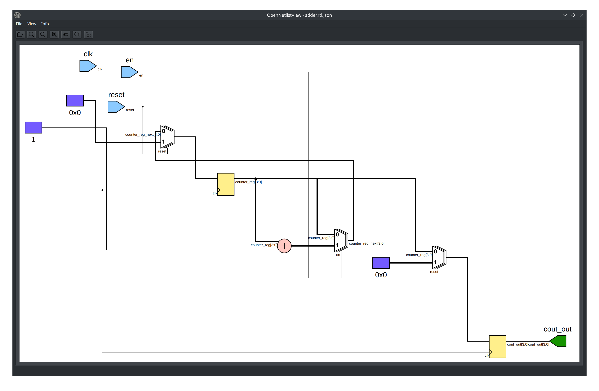

# OpenNetlistView

OpenNetlistView is a tool for viewing netlists in the [Yosys](https://yosyshq.readthedocs.io/en/latest/)
JSON format. It is designed to run as an native application and a WASM application in a web browser.

The project was developed as part of a master thesis. The finished thesis can be found
[here](docs/technical_report/masterthesis.pdf).

**Note:** The current version is a prototype. The generation of schematics for bigger and more
complex designs can be very slow.

**Try the web version [here](https://lukbau.github.io/OpenNetlistView/demo/OpenNetlistView.html)**

## Licence

The project is licensed under the GPL3 license. See the [LICENCE](LICENCE) file for more information.

## Usage

The tool can be used to view digital circuits that are described in the Yosys JSON format.
This works for both rtl and technology mapped netlists.

### Installation

#### Linux

Releases of the native application for Linux are available on the [releases page](https://github.com/hsa-ees/OpenNetlistView/releases)
as AppImage files.

- Download the AppImage file
- Make the file executable with `chmod u+x OpenNetlistView-<version>.AppImage`
- Run the file with `./OpenNetlistView-<version>.AppImage`

#### Web

The web version of the tool is available on the [release page](https://github.com/hsa-ees/OpenNetlistView/releases) page as a tar.gz file.

- Download the tar.gz file
- Extract the file with `tar -xvf OpenNetlistView-<version>.tar.gz`
- Host the files on a web server (e.g localy with `python3 -m http.server` in the extracted directory)

#### For other platforms

The tool can be built from source for other platforms.
Detailed instructions can be found in the user documentation.

Which can be found [here](https://lukbau.github.io/OpenNetlistView/user_guide/building_app.html)

## Documentation

The user documentation is available [here](https://lukbau.github.io/OpenNetlistView/user_guide).
